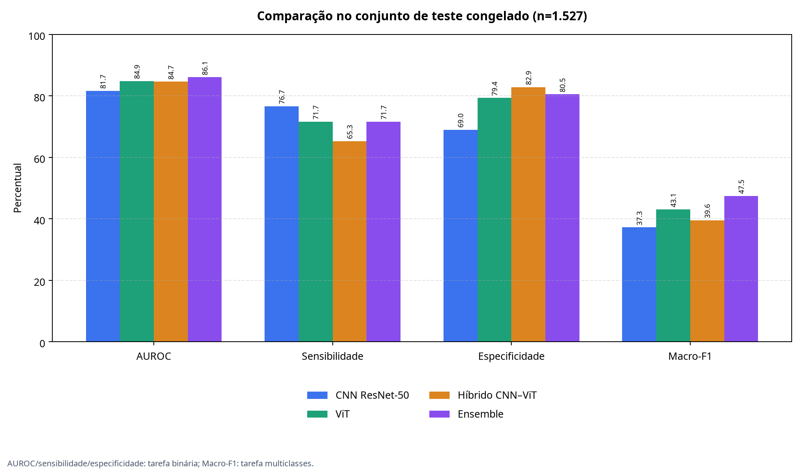

# Relatório experimental — backend científico do SkinCancerCADDermoIA

## Escopo e objetivo

Este relatório documenta a execução reproduzível do backend para classificação dermatoscópica multiclasses e binária. Foram treinados três componentes independentes — CNN baseada em ResNet-50, Vision Transformer e modelo híbrido CNN–ViT — e foi construído um ensemble com probabilidades calibradas. O front-end não participa do treinamento e não foi usado para produzir as métricas. O sistema deve ser interpretado como ferramenta de apoio à pesquisa e triagem computacional, não como diagnóstico autônomo.

O dataset HAM10000 foi obtido da versão 4.0 disponibilizada pelo Harvard Dataverse, sob licença CC BY-NC 4.0, com uso acadêmico não comercial confirmado para este projeto e atribuição obrigatória [1]. O conjunto contém 10.015 imagens. A divisão foi determinística, com `seed=42`, estratificação e agrupamento por `lesion_id`, aproximadamente em 70% para treino, 15% para validação e 15% para teste. O agrupamento por lesão evita que imagens da mesma lesão atravessem os subconjuntos. O metadata utilizado não contém `patient_id`; portanto, não é possível afirmar independência entre pacientes.

## Configuração do experimento

| Componente | Arquitetura | Configuração efetivamente executada |
|---|---|---|
| CNN | ResNet-50 multitarefa | 2 épocas, 160×160 px, backbone congelado, amostragem balanceada no treino |
| ViT | `vit_small_patch16_224` adaptado para 160×160 px | 2 épocas, backbone congelado, amostragem balanceada no treino |
| Híbrido | ResNet-50 congelada, projeção em tokens, dois blocos de atenção e gate de fusão | 2 épocas, 160×160 px, backbone congelado, amostragem balanceada no treino |
| Ensemble | Média ponderada das probabilidades calibradas | Pesos selecionados somente na validação, com mínimo de 10% por componente |

A perda combina focal loss multiclasses com ponderação baseada no número efetivo de exemplos e focal loss binária ponderada. A opção `--balanced-sampler` foi aplicada exclusivamente ao treino. A calibração por temperatura foi ajustada exclusivamente na validação; o conjunto de teste permaneceu congelado até a avaliação final. O treinamento desta rodada foi realizado em CPU, com poucas épocas e resolução reduzida, para validar o pipeline completo e gerar checkpoints funcionais.

## Auditoria de classes raras e representatividade

A auditoria reproduzível em `docs/experiments/HAM10000_BIAS_AUDIT.json` confirmou o forte desbalanceamento da base. A classe `nv` representa 66,95% das imagens, enquanto `df` representa 1,15% e `vasc` 1,42%. No teste congelado, `df` possui apenas 10 imagens e `vasc` possui 29. Esses suportes devem aparecer junto das métricas e impedem interpretações fortes para as classes raras.

| Classe | Suporte total | Proporção total | Suporte no teste | F1 ensemble | AUPRC one-vs-rest ensemble |
|---|---:|---:|---:|---:|---:|
| `akiec` | 327 | 3,27% | 48 | 0,3731 | 0,3514 |
| `bcc` | 514 | 5,13% | 66 | 0,4298 | 0,4599 |
| `bkl` | 1.099 | 10,97% | 172 | 0,3916 | 0,4511 |
| `df` | 115 | 1,15% | 10 | 0,2857 | 0,4571 |
| `mel` | 1.113 | 11,11% | 186 | 0,4649 | 0,4691 |
| `nv` | 6.705 | 66,95% | 1.016 | 0,8007 | 0,9637 |
| `vasc` | 142 | 1,42% | 29 | 0,5778 | 0,7278 |

O metadata contém idade, sexo e localização, mas não contém rótulo validado de tom de pele/Fitzpatrick nem `patient_id`. Não foi feita inferência de tom de pele a partir dos pixels. Consequentemente, não é metodologicamente válido afirmar equidade para peles negras usando apenas o HAM10000. A dissertação deve declarar a ausência dessa evidência, em vez de concluir que não existe viés.

A literatura mostra que sistemas dermatológicos podem sofrer queda de desempenho em tons de pele escuros e em doenças incomuns [3]. O conjunto DDI foi construído com imagens Fitzpatrick I–VI, comparação entre grupos tonais e confirmação patológica [4]. A validação externa recomendada para a versão final deve usar uma base autorizada com anotação tonal validada. O script `ml/evaluate_subgroups.py` foi preparado para essa etapa; ele exige que predições e metadata externo estejam na mesma ordem e não atribui rótulos tonais automaticamente.

## Pesos e desempenho no teste congelado

Os pesos foram selecionados na validação por uma função que combina macro-F1 multiclasses e AUROC binária. O resultado desta rodada foi **CNN 10%, ViT 50% e híbrido 40%**. O peso mínimo de 10% garante participação dos três modelos, mas não deve ser confundido com uma estimativa de importância clínica.

| Modelo | Macro-F1 multiclasses | AUROC multiclasses | AUROC binária | Sensibilidade | Especificidade | MCC binário | ECE binário |
|---|---:|---:|---:|---:|---:|---:|---:|
| CNN ResNet-50 | 0,3725 | 0,8748 | 0,8167 | 0,7667 | 0,6903 | 0,3707 | 0,2693 |
| ViT | 0,4311 | 0,8922 | 0,8487 | 0,7167 | 0,7938 | 0,4399 | 0,1985 |
| Híbrido CNN–ViT | 0,3957 | 0,8853 | 0,8465 | 0,6533 | 0,8289 | 0,4336 | 0,0370 |
| Ensemble | **0,4748** | **0,9096** | **0,8607** | **0,7167** | **0,8052** | **0,4537** | **0,0795** |

No conjunto de teste com 1.527 imagens, o ensemble apresentou acurácia multiclasses de 0,6398, balanced accuracy de 0,6009, AUPRC multiclasses de 0,5543 e Brier score de 0,4865. Na tarefa binária, apresentou acurácia de 0,7878, balanced accuracy de 0,7609, precisão de 0,4736, F1 de 0,5703 e AUPRC de 0,5946. As métricas completas, matrizes de confusão, métricas por classe e previsões estão em `ml_artifacts/ham10000/ensemble/test_metrics.json` e `ml_artifacts/ham10000/ensemble/test_predictions.npz`.

*Figura 1 — Comparação de AUROC, sensibilidade, especificidade e Macro-F1 no conjunto de teste congelado. AUROC, sensibilidade e especificidade correspondem à tarefa binária; Macro-F1 corresponde à tarefa multiclasses. A figura é gerada por `ml/plot_test_metrics.py`.*

Os intervalos de confiança percentílicos de 95%, calculados por 1.000 reamostragens bootstrap com `seed=42`, foram os seguintes:

| Métrica | Estimativa média bootstrap | IC 95% |
|---|---:|---:|
| Macro-F1 multiclasses | 0,4727 | 0,4282–0,5186 |
| AUROC multiclasses | 0,9095 | 0,8923–0,9242 |
| AUROC binária | 0,8607 | 0,8398–0,8814 |
| Sensibilidade binária | 0,7160 | 0,6610–0,7693 |
| Especificidade binária | 0,8056 | 0,7831–0,8273 |
| F1 binário | 0,5695 | 0,5261–0,6131 |

Os intervalos quantificam a variabilidade amostral sob o teste congelado; não substituem validação externa, análise por paciente ou avaliação clínica prospectiva.

## Triagem de qualidade e rejeição fora do domínio

Antes da inferência, o backend verifica decodificação, resolução mínima de 128×128, limites dimensionais, proporção extrema, detalhe visual, exposição, uniformidade e distância robusta em relação à distribuição de características do HAM10000. A referência foi calibrada com treino e validação, e o limiar OOD registrado é `196,2295`. Quando a referência não está configurada, a integração exige sua presença e não classifica silenciosamente a entrada.

| Entrada de teste | Resultado | Evidência |
|---|---|---|
| Imagem dermatoscópica HAM10000 | Aceita | `ood_score=0,8095`, abaixo de `196,2295` |
| Fotografia de carro | Rejeitada antes do modelo | `outside_dermoscopy_domain`, `ood_score=469,3036` |
| Fotografia de cabeça/cabelo | Rejeitada antes do modelo | `outside_dermoscopy_domain`, `ood_score=503,8872` |
| Imagem uniforme e resolução insuficiente | Rejeitada pelos testes do gate | Testes automatizados em `tests/test_quality_gate.py` |

O teste end-to-end TypeScript confirmou que carro e cabeça/cabelo retornam `IMAGE_NOT_ELIGIBLE` e não avançam para CNN, ViT, híbrido ou heatmaps. Esses exemplos comprovam o funcionamento do gate para os casos testados, mas não garantem rejeição perfeita para todos os objetos, rostos, cabelos, fotografias clínicas, condições de iluminação ou imagens dermatoscópicas atípicas.

## Inferência, incerteza e integração

Na imagem HAM10000 aceita, CNN, ViT e híbrido retornaram classificação binária `benign`. O serviço TypeScript executou os três componentes em paralelo, combinou os pesos persistidos em `ml_artifacts/ham10000/ensemble/weights.json` e retornou classificação final `benign` com confiança de 97,9253%, entropia preditiva média de 0,2980, variância TTA de 0,0000683 e `abstain=false`. Esses valores são resultado de uma imagem de demonstração e não representam desempenho clínico.

A incerteza é operacional: a abstensão é acionada quando a entropia preditiva ou a variância das transformações TTA ultrapassa os limiares definidos no pipeline. A calibração de temperatura reduz distorções de probabilidade, mas não transforma a confiança em probabilidade clínica de diagnóstico.

## Explicabilidade

Foram gerados heatmaps reais com os checkpoints finais em `ml_artifacts/ham10000/xai/demo/`. A CNN produziu Grad-CAM; o ViT produziu atribuição de tokens; e o híbrido produziu Grad-CAM convolucional, atribuição de tokens, rollout de atenção e mapa combinado. A inspeção visual confirmou a gravação dos PNGs e concentração da saliência da CNN e do mapa híbrido na região da lesão de demonstração. O mapa de tokens apresentou menor contraste, e o rollout de atenção mostrou focos periféricos adicionais.

Esses mapas são explicações aproximadas das regiões que influenciaram a saída [2]. Como o protocolo não utiliza máscara clínica de localização, os heatmaps não devem ser descritos como delimitação anatômica, causalidade ou prova de que o modelo ignorou artefatos.

## Verificações executadas

| Verificação | Resultado |
|---|---|
| Testes Python | 9 testes aprovados |
| Verificação TypeScript | Aprovada com `pnpm check` |
| Testes Vitest | 2 arquivos e 4 testes aprovados |
| Build de produção | Aprovado; apenas aviso de chunk front-end acima de 500 kB |
| Avaliação de teste por modelo | CNN, ViT e híbrido avaliados em 1.527 imagens |
| Ensemble | Pesos selecionados na validação e teste congelado avaliado |
| Bootstrap | 1.000 reamostragens, `seed=42`, IC 95% gerado |
| Gate OOD | HAM10000 válido aceito; carro e cabeça/cabelo rejeitados |
| Serviço TypeScript | Classificação aceita e três heatmaps gerados |

## Limitações e próximos experimentos

Os checkpoints atuais foram treinados com duas épocas, backbone congelado e resolução de 160×160 em CPU. Eles demonstram que o pipeline científico e a integração estão funcionais, mas não representam a versão experimental final ideal para uma dissertação. O treinamento final deve usar a GTX 1050 Ti ou outra GPU compatível, 224×224 px, mais épocas, descongelamento progressivo, ajuste de hiperparâmetros e múltiplas sementes. A comparação deve preservar a separação entre validação e teste.

A base é desbalanceada, possui suporte muito baixo para `df` e `vasc`, não contém tom de pele validado e não contém `patient_id` no metadata usado. Portanto, não se deve afirmar ausência de viés contra peles negras, generalização clínica ou equidade. A conclusão defensável exige validação externa autorizada, subgrupos tonais anotados, intervalos de confiança, análise por paciente e relato explícito de suporte.

Não é metodologicamente aceitável fabricar imagens sintéticas de pele negra, duplicar casos raros ou inferir Fitzpatrick pelos pixels para preencher essa lacuna. O caminho recomendado é obter dados externos licenciados, avaliar os subgrupos com rótulos confiáveis e declarar a ausência de evidência quando o suporte for insuficiente.

O código público não deve conter imagens brutas, checkpoints binários, logs de execução, imagens OOD baixadas para demonstração ou credenciais. O HAM10000 é usado localmente sob a licença não comercial aplicável; o repositório deve preservar a atribuição e não redistribuir o dataset.

## Referências

[1]: https://dataverse.harvard.edu/dataset.xhtml?persistentId=doi:10.7910/DVN/DBW86T "HAM10000 no Harvard Dataverse, versão 4.0"

[2]: https://openaccess.thecvf.com/content_iccv_2017/html/Selvaraju_Grad-CAM_Visual_Explanations_ICCV_2017_paper.html "Grad-CAM: Visual Explanations from Deep Networks via Gradient-Based Localization"

[3]: https://pubmed.ncbi.nlm.nih.gov/35960806/ "Disparities in dermatology AI performance on a diverse, curated clinical image set"

[4]: https://ddi-dataset.github.io/ "Diverse Dermatology Images: conjunto de doenças dermatológicas com diversidade de tons de pele e confirmação por biópsia"
